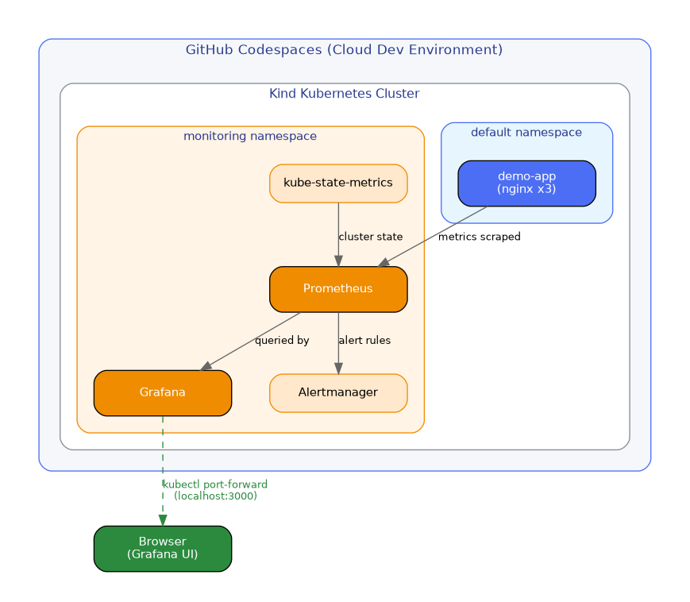

# Kubernetes Monitoring Dashboard

A DevOps project that deploys a real observability stack — Prometheus and Grafana — on a Kubernetes cluster to monitor application health, resource usage, and cluster status in real time.

Built and fully tested inside GitHub Codespaces, with no local machine dependencies.

## What This Project Does

- Spins up a Kubernetes cluster and deploys a sample containerized application
- Installs a production-grade monitoring stack (Prometheus, Grafana, Alertmanager, kube-state-metrics) using Helm
- Visualizes live cluster and application metrics through pre-built Grafana dashboards
- Demonstrates real troubleshooting of Kubernetes pod startup and networking behavior

This project reflects the kind of observability setup used in real production environments — the same core stack (Prometheus + Grafana) that companies rely on to monitor their infrastructure.

## Architecture

The application runs in its own namespace, while Prometheus continuously scrapes metrics from the cluster and the app. Grafana queries Prometheus and renders that data as dashboards, which are made accessible locally through kubectl port-forward.

## Tech Stack

Kind · Kubernetes · kubectl · Helm · Prometheus · Grafana · Alertmanager

## Dashboards

All available Grafana dashboards, auto-installed with the monitoring stack:

Cluster-wide resource usage — CPU and memory across all nodes and namespaces:

Per-namespace pod metrics — tracking the health of individual workloads:

Kubernetes API server health and request performance:

## Verification

Confirming all workloads are healthy before relying on the dashboards:

Application pods running:

Monitoring stack pods running:

## Challenges & How I Solved Them

**Grafana pod stuck in ContainerCreating**
Right after installing the monitoring stack, the Grafana pod stayed in a pending state for a couple of minutes while its container image was being pulled. Instead of assuming something was broken, I inspected the pod's event log using `kubectl describe pod`, confirmed it was just an image pull in progress, and waited for it to resolve on its own.

**Port-forward terminal appeared unresponsive**
Running `kubectl port-forward` made the terminal look "frozen," only printing repeated connection logs. I recognized this as expected behavior rather than a crash — it's a blocking command that has to stay running to keep the tunnel alive — and opened a separate terminal tab to continue running other commands.

**Retrieving the Grafana login credentials**
The monitoring stack auto-generates a random admin password stored as a Kubernetes Secret rather than using a default password. I identified this from the Helm chart's behavior and decoded the credential directly from the cluster using `kubectl get secret` piped through `base64 --decode`.

**Verifying success instead of assuming it**
Rather than trusting that the stack was "probably working," I explicitly checked pod status across both the application and monitoring namespaces before relying on any dashboard data, catching issues early instead of debugging blind later.

## Skills Demonstrated

- Kubernetes cluster setup, deployment, and workload management
- Installing and configuring multi-component systems with Helm
- Reading and interpreting real-time observability data (Prometheus/Grafana)
- Debugging Kubernetes pod states and networking behavior under time pressure
- Working entirely in a cloud-based dev environment (GitHub Codespaces)

## Related Projects

- [my-first-devops-project](https://github.com/sarahsaleem43-s/my-first-devops-project) — CI/CD pipeline with Docker and GitHub Actions
- [serverless-automation-pipeline](https://github.com/sarahsaleem43-s/serverless-automation-pipeline) — Serverless automation on AWS using Terraform

