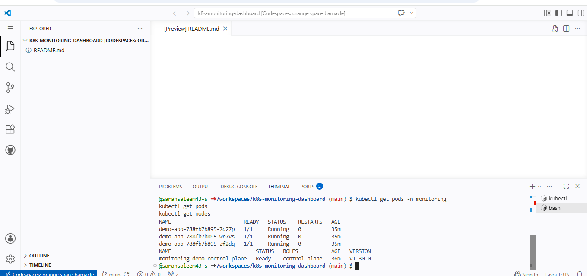
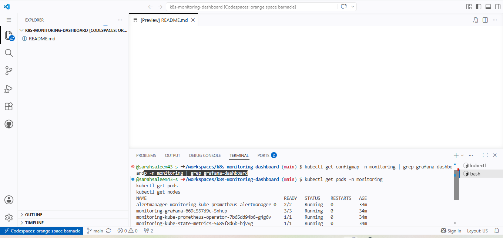
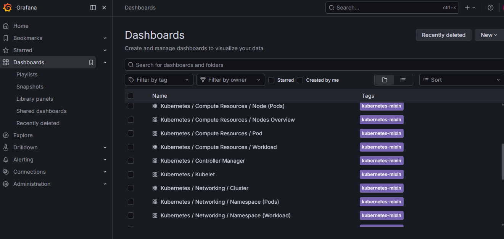
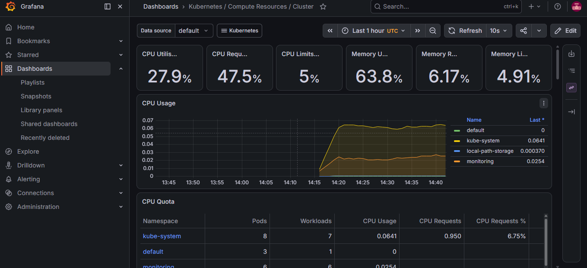
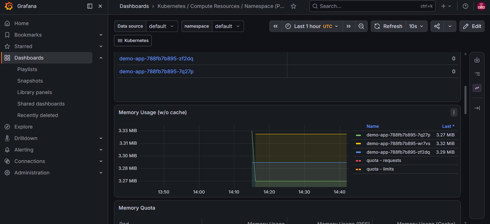
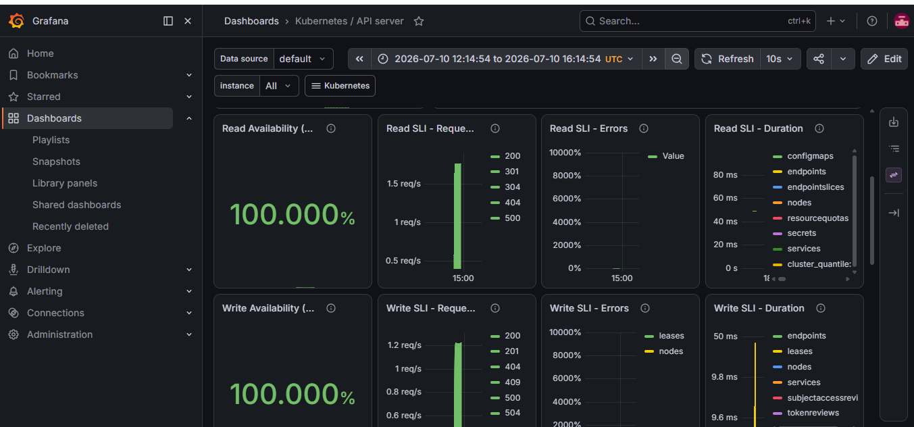

# Kubernetes Monitoring Dashboard

A hands-on DevOps project demonstrating how to deploy a full observability stack (Prometheus + Grafana) on a local Kubernetes cluster, built and tested entirely inside GitHub Codespaces.

## Overview

This project sets up a local Kubernetes cluster and deploys a production-style monitoring stack to observe cluster health, pod status, and resource usage in real time. It covers the full workflow of provisioning infrastructure, deploying a workload, installing monitoring tools via Helm, and visualizing metrics through Grafana dashboards.

**What this project demonstrates:**
- Creating a Kubernetes cluster locally using Kind (Kubernetes IN Docker)
- Deploying and exposing a containerized application
- Installing Prometheus, Grafana, and Alertmanager as a single Helm release
- Accessing and reading real-time cluster metrics through Grafana
- Debugging common Kubernetes networking and pod startup issues

## Architecture
GitHub Codespaces (Cloud Dev Environment)
┌─────────────────────────────────────────────────────────────────┐
│                                                                   │
│                    Kind Kubernetes Cluster                       │
│                                                                   │
│   ┌────────────────────┐        ┌─────────────────────────────┐ │
│   │  default namespace  │        │      monitoring namespace    │ │
│   │                      │        │                               │ │
│   │   demo-app           │        │   Prometheus  ◄── scrapes ──┐ │ │
│   │   (nginx, 3 pods)     │───────┼──►  metrics from all pods    │ │ │
│   │                      │        │        │                     │ │
│   │                      │        │        ▼                     │ │
│   │                      │        │   Grafana (reads Prometheus) │ │
│   │                      │        │        │                     │ │
│   │                      │        │   Alertmanager                │ │
│   │                      │        │   kube-state-metrics           │ │
│   └────────────────────┘        └─────────────────────────────┘ │
│                                                                   │
└──────────────────────────────┬────────────────────────────────────┘
│
kubectl port-forward (localhost:3000)
│
▼
Browser → Grafana Web UI
**Data flow:** kube-state-metrics and node exporters collect state/resource data → Prometheus scrapes and stores it as time-series data → Grafana queries Prometheus and renders it as dashboards → port-forward tunnels the Grafana UI from inside the cluster out to the browser.

## Tech Stack

| Tool | Purpose |
|------|---------|
| Kind | Local Kubernetes cluster, runs inside Docker |
| kubectl | CLI for managing Kubernetes resources |
| Helm | Package manager used to install the monitoring stack |
| Prometheus | Collects and stores cluster and application metrics |
| Grafana | Visualizes metrics through dashboards |
| Alertmanager | Handles alerting based on defined thresholds |
| kube-state-metrics | Exposes Kubernetes object state (pods, deployments, nodes) as metrics |

## Setup Instructions

### 1. Install Required Tools

```bash
# Install Kind
curl -Lo ./kind https://kind.sigs.k8s.io/dl/v0.23.0/kind-linux-amd64
chmod +x ./kind
sudo mv ./kind /usr/local/bin/kind

# Install kubectl
curl -LO "https://dl.k8s.io/release/$(curl -L -s https://dl.k8s.io/release/stable.txt)/bin/linux/amd64/kubectl"
chmod +x kubectl
sudo mv kubectl /usr/local/bin/

# Install Helm
curl https://raw.githubusercontent.com/helm/helm/main/scripts/get-helm-3 | bash
```

### 2. Create the Kubernetes Cluster

```bash
kind create cluster --name monitoring-demo
kubectl cluster-info
kubectl get nodes
```

### 3. Deploy a Sample Application

```bash
kubectl create deployment demo-app --image=nginx --replicas=3
kubectl expose deployment demo-app --port=80 --type=ClusterIP
```

### 4. Install the Monitoring Stack

```bash
helm repo add prometheus-community https://prometheus-community.github.io/helm-charts
helm repo update

helm install monitoring prometheus-community/kube-prometheus-stack \
  --namespace monitoring --create-namespace
```

### 5. Access Grafana

```bash
kubectl port-forward -n monitoring svc/monitoring-grafana 3000:80
```

Retrieve the admin password:

```bash
kubectl get secret -n monitoring monitoring-grafana \
  -o jsonpath="{.data.admin-password}" | base64 --decode
```

Login with username `admin` and the decoded password. Open the **Dashboards** section in Grafana to explore the pre-built dashboards.

## Verification

Confirm all workloads are healthy before relying on the dashboards:

```bash
kubectl get pods
kubectl get nodes
kubectl get pods -n monitoring
```

Expected output — application pods running:



Expected output — monitoring stack pods running:



## Dashboards

All available Grafana dashboards, auto-installed by the `kube-prometheus-stack` Helm chart:



Cluster-wide resource usage (CPU, memory across all nodes and namespaces):



Per-namespace pod-level metrics:



Kubernetes API server health and request latency:



## Errors Faced & Troubleshooting

**1. Grafana pod stuck in `ContainerCreating`**
Right after installing the Helm chart, `kubectl get pods -n monitoring` showed the Grafana pod as `0/3 ContainerCreating` for a couple of minutes. This is normal — it happens while the container image is being pulled. Waiting 2–5 minutes and re-running the command resolved it. To inspect the cause directly, `kubectl describe pod <pod-name> -n monitoring` shows the event log.

**2. Port-forward terminal looked "frozen"**
After running `kubectl port-forward`, the terminal appeared to stop responding, only showing repeated lines like `Handling connection for 3000`. This is not an error — `port-forward` is a blocking, long-running command that must stay open for the tunnel to work. A separate terminal tab is needed to run any further commands.

**3. Grafana admin password**
Since the Helm chart auto-generates a random admin password stored as a Kubernetes Secret, it needed to be decoded manually with `kubectl get secret ... | base64 --decode` rather than using a default password.

## Key Learnings

- Setting up and managing a local Kubernetes cluster with Kind
- Deploying and exposing workloads using kubectl
- Installing multi-component applications with Helm in a single command
- Understanding how Prometheus scrapes metrics and how Grafana visualizes them
- Reading Kubernetes secrets to retrieve auto-generated credentials
- Diagnosing pod startup states (`ContainerCreating`, `Running`, `CrashLoopBackOff`)
- Understanding blocking vs. non-blocking terminal commands (`port-forward`)


